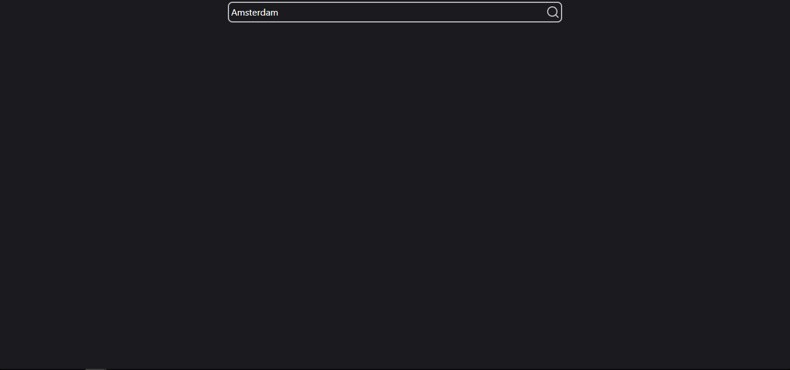
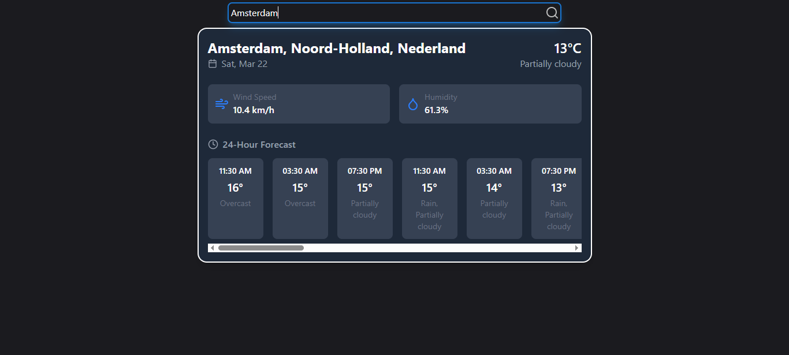
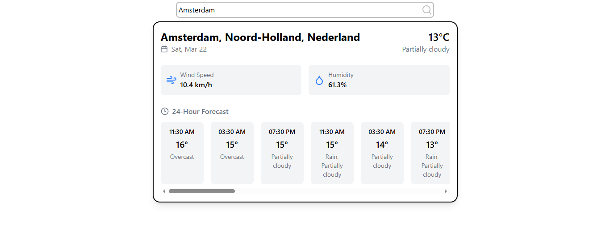

## Features ✨

 - 🔎 Search location
 - 🌗 Dark/Light theme 
 - 📱 Responsive design
 - 💫 Dynamic
 - ⏰ Hourly forecast
 - 🌡️ Current weather conditions:
    - Temperature
    - Wind speed
    - Humidity

## 🛠️ Technologies Used
 - Vite 
 - React
 - Tailwind CSS
 - Lucide Icons
 - Visual Crossing Weather API

## preview 📷

  
  

  

