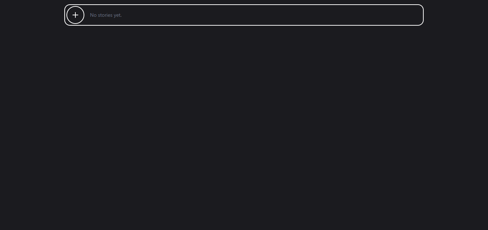
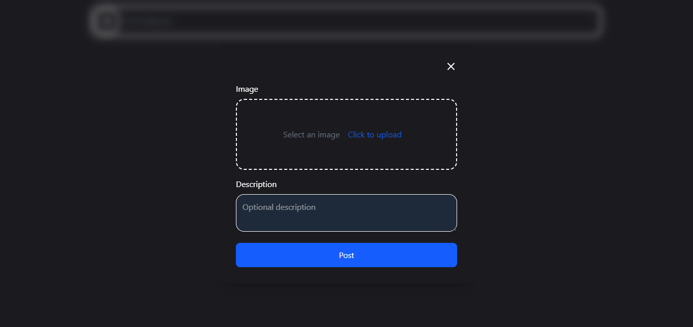
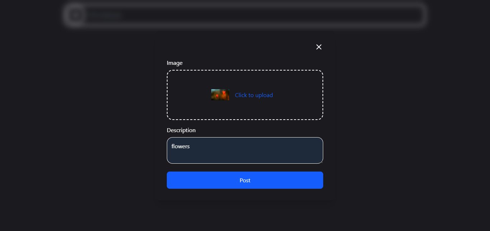
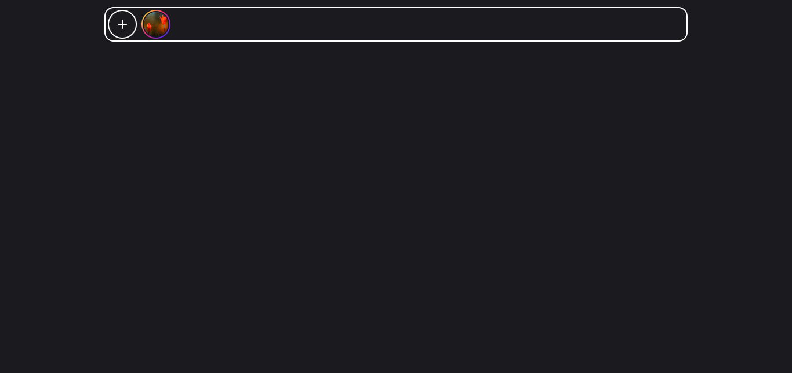
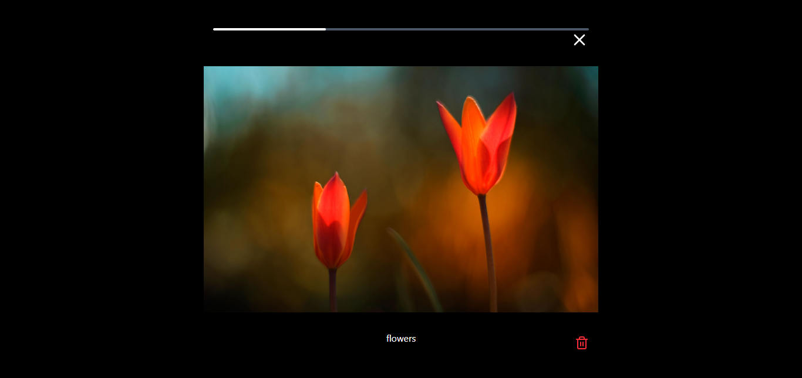
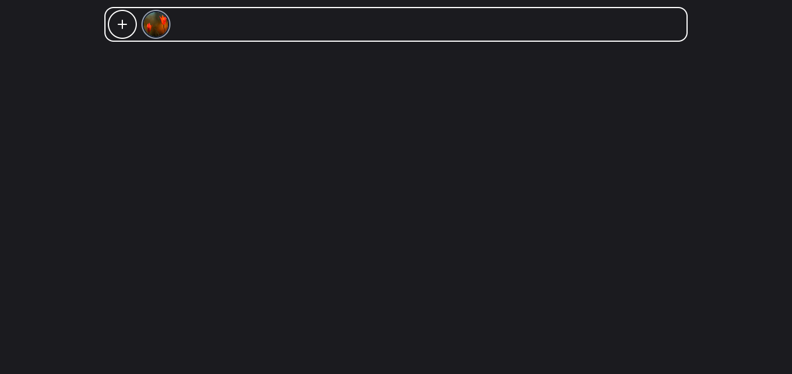

## Features ✨ 

 - 🌗 Dark/Light theme 
 - 📱 Responsive design
 - ⚙ Add/Delete stories
 - ⏳ Progress bar for each story
 - 📌 Seen story 

## 🛠️ Technologies Used
 - Vite 
 - React
 - Formik
 - Yup
 - Tailwind CSS
 - Lucide Icons
 - SwiperJS
 - LocalStorage

 ## preview 📷

  
  

  
  

  
  

